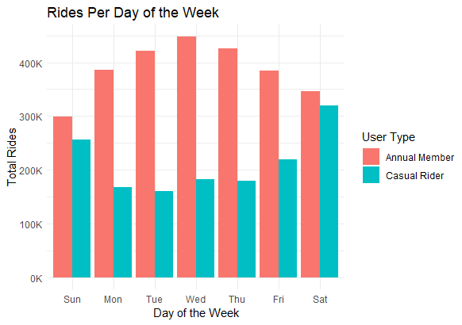
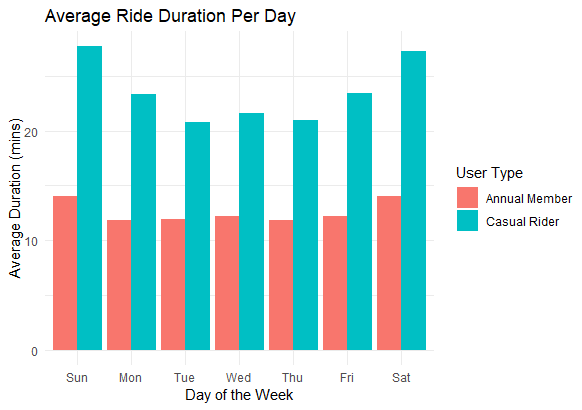
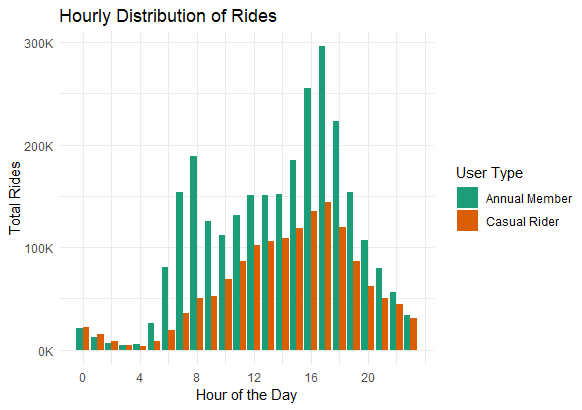
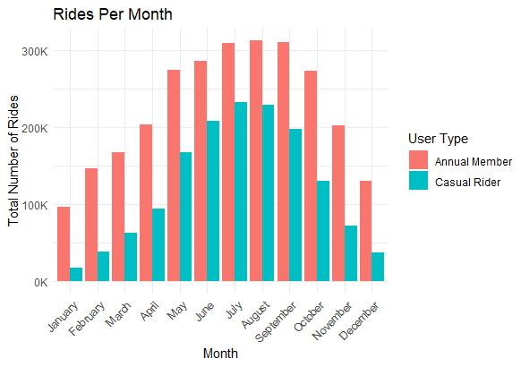

**<u>CYCLISTIC BIKE-SHARE ANALYSIS REPORT</u>**

**1. Introduction**

Cyclistic is a bike-share company in Chicago with a growing fleet of
bicycles and an extensive network of docking stations. The company
offers flexible pricing plans, including single-ride passes, full-day
passes, and annual memberships.

The goal of this analysis is to understand how casual riders and annual
members use Cyclistic bikes differently. Insights from this study will
help the marketing team convert casual riders into annual members,
increasing customer retention and profitability.

**2. Business Task**

The primary business question to address:

How do annual members and casual riders use Cyclistic bikes differently?

The insights derived will support Cyclistic’s marketing strategy to
maximize the number of annual memberships.

**3. Data Sources & Preparation**

<u>Data Description</u>

- The dataset consists of 12 months of ride data from September 2023 –
  August 2024.

- Data was obtained from Divvy (Motivate International Inc.), which
  manages Chicago’s public bike-share system.

- It includes ride start and end times, ride duration, bike type, and
  user type (casual vs. member).

- Privacy compliance: No personally identifiable information is included
  in the dataset.

<u>Data Cleaning & Processing</u>

To prepare the dataset for analysis:

✔ Merged 12 months of ride data into a single dataset.  
✔ Removed empty rows and columns to ensure clean data.  
✔ Converted date/time columns to appropriate formats.  
✔ Filtered out rides with negative or zero duration.  
✔ Created new variables:

- ride_duration (minutes)

- day_of_week, month_of_year (for trend analysis)

- start_hour, end_hour (for hourly distribution)

**4. Data Analysis & Insights**

<u>4.1 Rides Per Day of the Week</u>

Key Findings:

📌 Annual members ride more frequently on weekdays, suggesting they use
bikes primarily for commuting.  
📌 Casual riders take more trips on weekends, indicating leisure-based
usage.

Visualization:

<u>4.2 Ride Duration Comparison</u>

Key Findings:

📌 Casual riders have significantly longer ride durations compared to
annual members.  
📌 Members tend to use bikes for short, consistent rides, while casual
users take longer, possibly recreational trips.

Visualization:

<u>4.3 Hourly Ride Trends</u>

Key Findings:

📌 Peak ride hours differ:

- Members peak at 7-9 AM & 5-7 PM → Commuting hours.

- Casual riders peak at 10 AM - 4 PM → Leisure trips.

📌Casual users ride later in the day, while members prefer early
morning/evening rides.

Visualization:

<u>4.4 Monthly Usage Trends</u>

Key Findings:

📌 Casual riders are more active in summer months (May–August), while
members ride consistently throughout the year.  
📌 Weather may influence casual riders more than members.

Visualization:

**5. Key Takeaways & Recommendations**

<u>Key Findings Recap</u>

✔ Members use bikes for commuting (weekday peak usage, shorter rides).  
✔ Casual riders use bikes for leisure (weekend usage, longer rides).  
✔ Seasonal patterns show high casual rider activity in summer.

<u>Marketing Recommendations</u>

📢 1. Promote Annual Membership Discounts During Peak Casual Months

- Offer summer discounts or limited-time membership trials to casual
  riders.

📢 2. Incentivize Weekday Rides for Casual Riders

- Introduce weekday ride discounts for casual riders to build commuting
  habits.

📢 3. Target Digital Ads Based on Usage Behavior

- Run targeted ads on social media during peak casual rider hours (10 AM
  – 4 PM).

- Highlight member benefits (unlimited rides, cost savings, priority
  docking).

**6. Conclusion**

This analysis provides actionable insights into Cyclistic’s user
behavior. By targeting casual riders with strategic marketing campaigns,
the company can increase annual membership conversions, boosting
long-term revenue.

🔹 Next Steps:

- A/B test promotional campaigns for casual users.

- Analyze data for specific station-level trends.

- Implement targeted email & in-app marketing strategies.

**7. Appendix**

📂 [Full R Code](https://github.com/Aaqib91/Google-Analytics-Capstone-Project/blob/main/Cyclistic-Bike-Share.Rmd)
📂 [Raw Data Sample](https://divvy-tripdata.s3.amazonaws.com/index.html).
